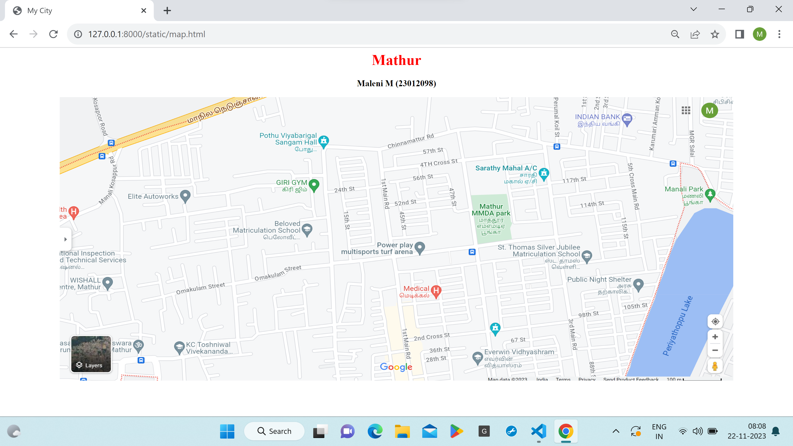

# Ex04 Places Around Me
## Date: 21.11.2023

## AIM
To develop a website to display details about the places around my house.

## DESIGN STEPS

### STEP 1
Create a Django admin interface.

### STEP 2
Download your city map from Google.

### STEP 3
Using ```<map>``` tag name the map.

### STEP 4
Create clickable regions in the image using ```<area>``` tag.

### STEP 5
Write HTML programs for all the regions identified.

### STEP 6
Execute the programs and publish them.

## CODE
```
map.html

<html>
<head>
<title>My City</title>
</head>
<body>
<h1 align="center">
<font color="red"><b>Mathur</b></font>
</h1>
<h3 align="center">
<font colr="blue"><b>Maleni M (23012098)</b></font>
</h3>
<center>

 
<map name="image_map">
  <area alt="Elite Autoworks" title="Elite Autoworks" href="elite.html" coords="494,481,715,632" shape="rect">
  <area alt="Indian Bank" title="Indian Bank" href="bank.html" coords="2690,117,87" shape="circle">
  <area alt="The Beloved Matriculaton Higher Secondary School" title="The Beloved Matriculaton Higher Secondary School" href="school.html" coords="1170,710,126" shape="circle">
<area alt="Giri Gym" title="Giri Gym" href="gym.html" coords="1061,429,1269,537" shape="rect">
  <area alt="Mathur MMDA Park" title="Mathur MMDA Park" href="park.html" coords="1949,511,2157,754" shape="rect">
</map>

</map>
</center>
</body>
</html>


school.html

<html>
<head>
<title>My Home Town</title>
</head>
<body bgcolor="aqua">
<h1 align="center">
<font color="red"><b>Mathur</b></font>
</h1>
<h3 align="center">
<font color="blue"><b>The Beloved Matriculation Higher Secondary School</b></font>
</h3>
<p align="justify">
<font face="Georgia" size="5">
This is the school were i completed my 11th and 12th standard.
My school is my second home where I spend most of my time. Above all, it gives me a platform to do better in life and also builds my personality. I feel blessed to study in one of the most prestigious and esteemed schools in the city. In addition, my school has a lot of assets which makes me feel fortunate to be a part of it.
In contrast to other schools, my school does not solely focus on academic performance. In other words, it emphasizes on the overall development of their students. Along with our academics, extra-curricular activities are also organized at our school. This is one of the main reasons why I love my school as it does not measure everyone on the same scale. Our hardworking staff gives time to each child to grow at their own pace which instils confidence in them. My school has all the facilities of a library, computer room, playground, basketball court and more, to ensure we have it all at our disposal</font>
</p>
</body>
</html>

elite.html

<html>
<head>
<title>My Home Town</title>
</head>
<body bgcolor="teal">
<h1 align="center">
<font color="red"><b>Mathur</b></font>
</h1>
<h3 align="center">
<font color="blue"><b>Elite Autoworks</b></font>
</h3>
<p align="justify">
<font face="Georgia" size="5">
With car ownership, comes the hassle of its maintainance.If you are a car owner, you expect it to last as long as it can.For car, it regularly requires Car Repair & Services.These services help you get rid of any minor or major probems you might be facing with your car.Regular servicing ensures that your car is functioning at its best.If you are looking for good car repairing services,then look no further than Elite Autoworks in Periyamathur,Chennai.</font>
</p>
</body>
</html>

park.html

<html>
<head>
<title>My Home Town</title>
</head>
<body bgcolor="purple">
<h1 align="center">
<font color="red"><b>Mathur</b></font>
</h1>
<h3 align="center">
<font color="blue"><b>Mathur MMDA Park</b></font>
</h3>
<p align="justify">
<font face="Georgia" size="5">
There is a park near my house is about one kilometer from my house. It has a well-developed grassland and tree areas, it also has sports grounds. I along with my friends, every evening goes to the park to play badminton and other games. Also, the park is well equipped with the area like a volleyball, basketball court, tennis court and what one desires for. The most beautiful time to come in is during the morning or evening for doing exercise and playing.

There is also a play area for children with disabilities. The playground and other activities make the place lively and colorful. The park is open every day from morning until evening..The park includes a skating rink,play area, a warm-up arena,pebble filled walking path,a meditation hall.Around this park there are so many shops which gives an look of festival on all time.</font>
</p>
</body>
</html>

gym.html
<html>
<head>
    <title>My Home Town</title>
    </head>
    <body bgcolor="fushsia">
    <h1 align="center">
    <font color="red"><b>Mathur</b></font>
    </h1>
    <h3 align="center">
    <font color="blue"><b>Giri Gym</b></font>
    </h3>
    <p align="justify">
    <font face="Georgia" size="5">
    Giri gym is spacious and well equipped.Gyms are places where people go to exercise. They have various machines and weights to help improve strength and fitness. Regular gym workouts can lead to better health and increased energy..Trainers are really experience and approachable.The assistance they are providing is worthy for building the physique.Going to the gym can help you stay fit and healthy. It can also help to reduce stress and improve sleep. Regular exercise can also boost your mood and improve your mental health.Overall I get this information from my brother who used to  go the giri gym for 3yrs.</font>
    </p>
    </body>
    </html>

bank.html

<html>
<head>
<title>My Home Town</title>
</head>
<body bgcolor="pink">
<h1 align="center">
<font color="red"><b>Mathur</b></font>
</h1>
<h3 align="center">
<font color="blue"><b>Indian Bank</b></font>
</h3>
<p align="justify">
<font face="Georgia" size="5">
Indian Bank is an Indian public sector bank, established in 1907 and headquartered in Chennai. It serves over 100 million customers with 41,645 employees, 5,814 branches with 4,929 ATMs and Cash deposit machines. Total business of the bank has touched ₹1,094,752 crore (US$140 billion) as on 31 March 2023.

The bank's Information systems and security processes are certified to meet ISO27001:2013 standard. It has overseas branches in Colombo and Singapore including Foreign Currency Banking Units at Colombo and Jaffna. It has 227 overseas correspondent banks in 75 countries. Since 1969, the Government of India has owned the bank. As per the announcement made by the Indian Finance Minister Nirmala Sitharaman on 30 August 2019, Allahabad Bank merged from 1 April 2020, making Indian Bank now the seventh largest bank in the country.</font>
</p>
</body>
</html>

```

## OUTPUT



## RESULT
The program for implementing image maps using HTML is executed successfully.
